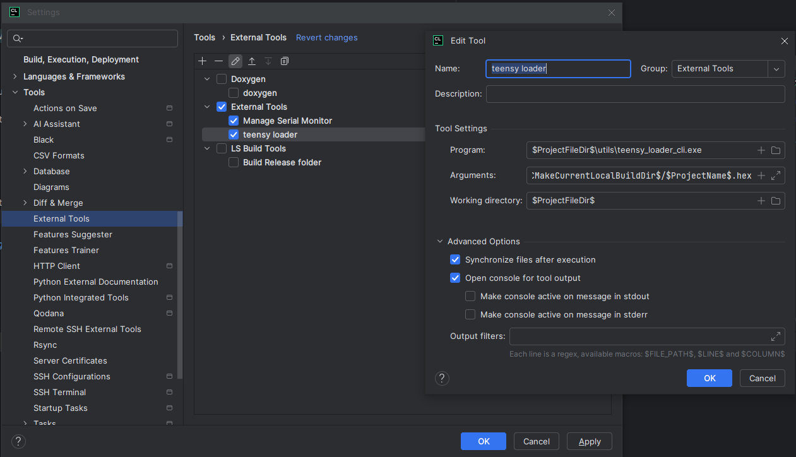
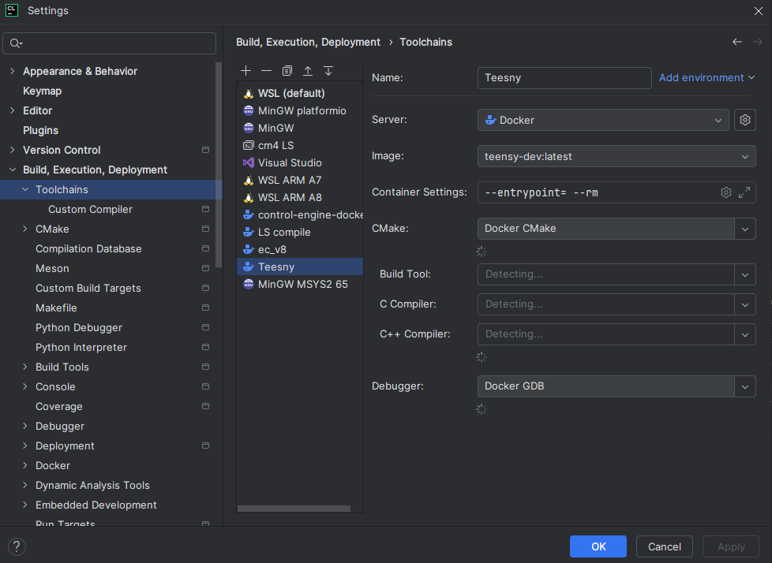
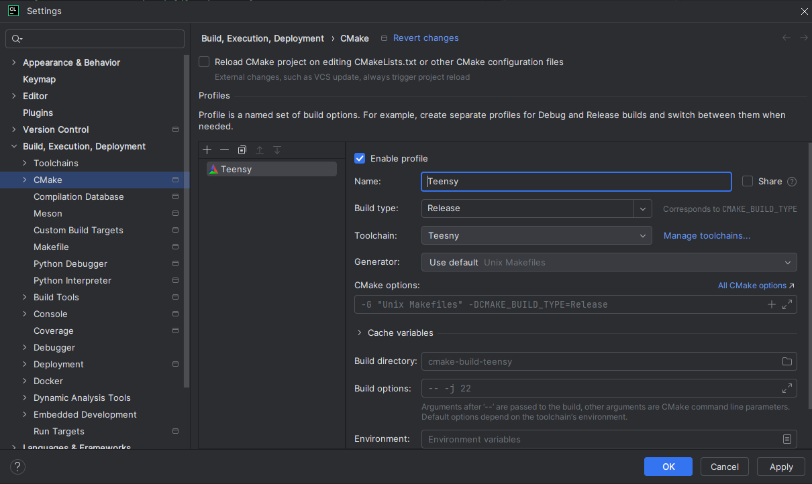
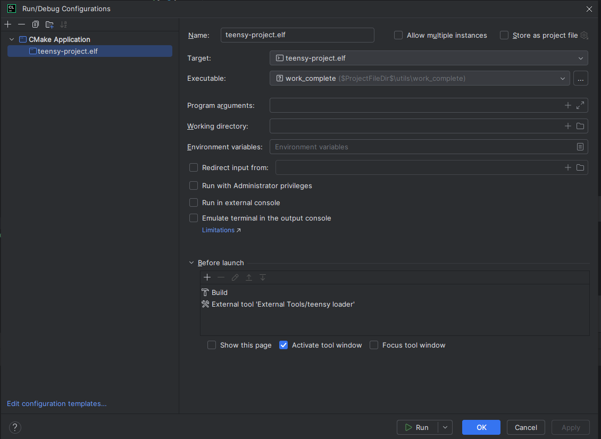

# Teensy development setup
using windows, clion and docker

This repository provides a complete development environment for Teensy microcontroller projects using Windows, CLion IDE, and Docker containerization. 
The setup streamlines the build process by leveraging Docker for cross-platform compilation while maintaining the convenience of CLion's integrated development environment.
This configuration includes automated build tools, integrated Teensy loader functionality, and serial monitoring capabilities for efficient embedded development workflow.

## Requirements
### Software

* Windows 10/11 - Host operating system
* CLion IDE - JetBrains C/C++ IDE with CMake support
* Docker Desktop - For containerized build environment
* Python 3.x - For serial monitoring utilities

### Hardware

* Teensy 4.1 microcontroller board
* USB cable - For programming and serial communication

### Prerequisites

* Docker Desktop installed and running
* CLion with valid license or evaluation version
* Basic familiarity with CMake and embedded development


## Rename Project
* CMakeList.txt
* Line 11 -> project(teensy-project C CXX ASM)
* Rename teensy-project to the name of the project

## Build Docker
* Terminal in clion
* New windows PowerShell
```
docker build -t teensy-dev .
```

## Teensy loader
* Settings -> Tools -> External Tools
* New Tool, Name "teensy loader"
```
* Program: $ProjectFileDir$\utils\teensy_loader_cli.exe
* Arguments: --mcu=TEENSY41 -v -w "$CMakeCurrentLocalGenerationDir$\$ProjectName$.hex"
* Working directory: $ProjectFileDir$
```


## Setup tool chain
* Settings -> Build, Execution, Deployment -> Toolchains
* New Docker
* Select teensy-dev:latest
* Rename Teensy




## Profile config
* Settings -> Build, Execution, Deployment -> CMake
* New 
```
* Name: Teensy
* Build type: Release 
* Toolchain: Teensy
```


## Configuration
* Cmake application
```
* Target: Teensy-project.elf
* Executable: $ProjectFileDir$\utils\work_complete
* Before Launch
  * Build
  * External Tool "teensy loader"
```



## Serial Monitor
* Clion terminal
* New PowerShell
* pip install pyserial
* python .\utils\serial_monitor.py 
 

